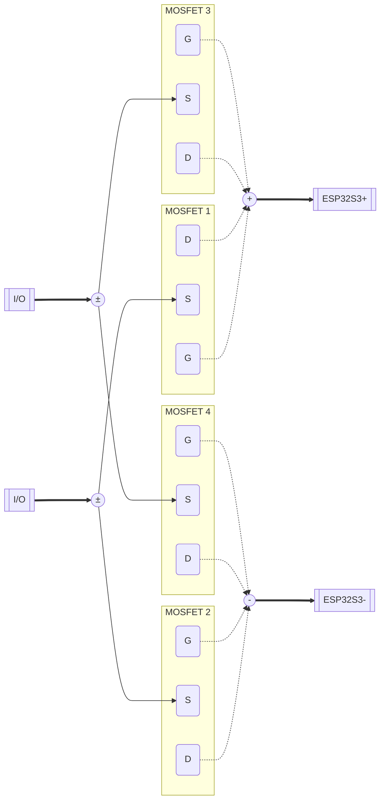

3.3v-5.7v 핫스왑회로(음극양극 상관없이)

* 여기에 커패시터를 추가하면 좀 더 안정적인 전압을 공급해 
MCU 코마상황(MCU가 DEEP SLEEP -> WAKEUP 트리거 시 깨어나지 못하고 혼수상태가 
지속되는-경우)에 아주 드라마틱한 도움을 준다 (경험담).

* 전압강하를 해결하려고 dd, tr 다해봤지만 mosfet을 이길 수 없으셈.

